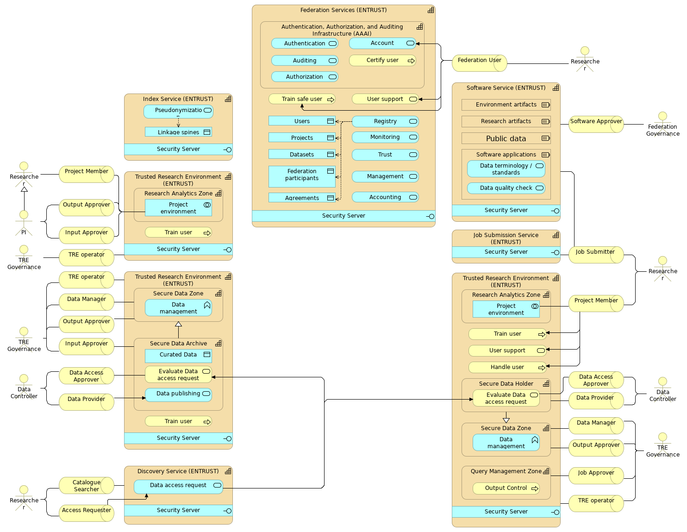

Architecture specifications
===========================

Participants in the EOSC-ENTRUST architecture are modelled as strategic capabilities and include one set of Federation Services, a number of Trusted Research Environments (TREs), and one or more Software Services, Index Services, Discovery Services, and Job Submission Services. TREs have at least one of three capabilities: Research Analytics Zones (RAZs), Secure Data Zones (SDZs), and Query Management Zones (QMZs). We illustrate three possible TRE configurations: a RAZ-only TRE, a SDZ-only TRE having the specialised capability of a Secure Data Archive, and a TRE with all three zones. Actors in the EOSC-ENTRUST architecture are Federation Governance, TRE Governance, Data Controller, Researcher, and PI, which is a specialised Researcher who leads a research Project and can take on the roles of Input and Output Approver in the Project’s RAZ Project environment.
